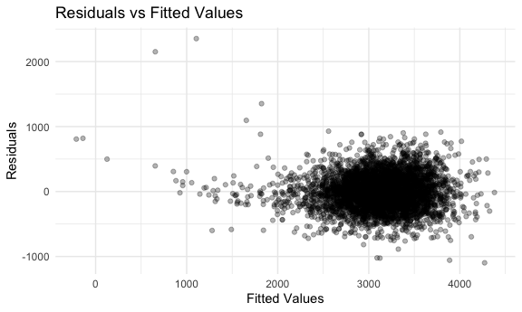
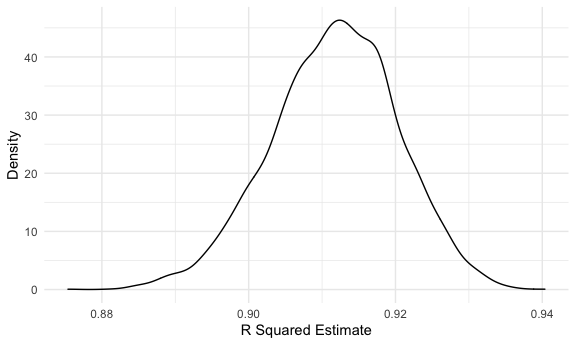
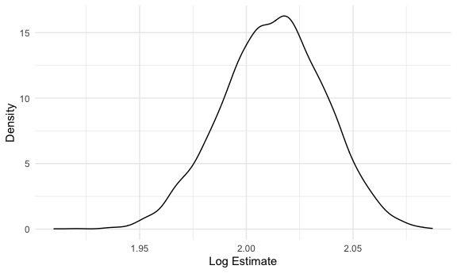

Homework 6
================
Fiona Ehrich

## Problem 1

First, I will read in the data and create a `city_state` variable and a
variable indicating whether the homicide is solved.

``` r
homicide_df = 
  read_csv("data/homicide-data.csv", na = c("", "NA", "Unknown")) %>% 
  mutate(
    city_state = str_c(city, state, sep = ", "),
    victim_age = as.numeric(victim_age),
    resolution = case_when(
      disposition == "Closed without arrest" ~ 0,
      disposition == "Open/No arrest"        ~ 0,
      disposition == "Closed by arrest"      ~ 1)
  ) %>% 
  filter(
    victim_race %in% c("White", "Black"),
    city_state != "Tulsa, AL") %>% 
  select(city_state, resolution, victim_age, victim_race, victim_sex)
```

I will start by fitting a logistic regression for Baltimore, MD.

``` r
baltimore_df =
  homicide_df %>% 
  filter(city_state == "Baltimore, MD")

glm(resolution ~ victim_age + victim_race + victim_sex, 
    data = baltimore_df,
    family = binomial()) %>% 
  broom::tidy() %>% 
  mutate(
    OR = exp(estimate),
    CI_lower = exp(estimate - 1.96 * std.error),
    CI_upper = exp(estimate + 1.96 * std.error)
  ) %>% 
  select(term, OR, starts_with("CI")) %>% 
  knitr::kable(digits = 3)
```

| term              |    OR | CI\_lower | CI\_upper |
| :---------------- | ----: | --------: | --------: |
| (Intercept)       | 1.363 |     0.975 |     1.907 |
| victim\_age       | 0.993 |     0.987 |     1.000 |
| victim\_raceWhite | 2.320 |     1.648 |     3.268 |
| victim\_sexMale   | 0.426 |     0.325 |     0.558 |

Now, I will run `glm` for each of the cities in the dataset and create a
data frame with estimated odds ratios and confidence intervals for each
city.

``` r
models_results_df = 
  homicide_df %>% 
  nest(data = -city_state) %>% 
  mutate(
    models = 
      map(.x = data, ~glm(resolution ~ victim_age + victim_race + victim_sex,
                          data = .x,
                          family = binomial())),
    results = map(models, broom::tidy)
  ) %>% 
  select(city_state, results) %>% 
  unnest(results) %>% 
  mutate(
    OR = exp(estimate),
    CI_lower = exp(estimate - 1.96 * std.error),
    CI_upper = exp(estimate + 1.96 * std.error)
  ) %>% 
  select(city_state, term, OR, starts_with("CI")) 
```

Finally, I will create a plot that shows the estimated odds ratios and
confidence intervals for each city.

``` r
models_results_df %>% 
  filter(term == "victim_sexMale") %>% 
  mutate(city_state = fct_reorder(city_state, OR)) %>% 
  ggplot(aes(x = city_state, y = OR)) + 
  geom_point() + 
  geom_errorbar(aes(ymin = CI_lower, ymax = CI_upper)) + 
  theme(axis.text.x = element_text(angle = 90, hjust = 1))
```


I notice that New York, NY has the lowest odds ratio, and Albuquerque,
NM has the highest odds ratio. Albuquerque, NM also appears to have the
widest confidence interval. There is a good amount over overlap among
the confidence intervals of the various cities.

## Problem 2

First, I will load and clean the data for regression analysis.

``` r
baby_df =
  read_csv("./data/birthweight.csv") %>% 
  mutate(
    babysex = as.factor(babysex),
    babysex = recode(babysex, "1" = "Male", "2" = "Female"),
    frace = as.factor(frace),
    frace = recode(frace, "1" = "White", "2" = "Black", "3" = "Asian", "4" = "Puerto Rican", "8" = "Other", "9" = "Unknown"),
    malform = as.factor(malform),
    malform = recode(malform, "0" = "Absent", "1" = "Present"),
    mrace = as.factor(mrace),
    mrace = recode(mrace, "1" = "White", "2" = "Black", "3" = "Asian", "4" = "Puerto Rican", "8" = "Other")
  )

# Checking to see if missing data
sum(is.na(baby_df))
```

    ## [1] 0

It doesn’t look like there are any missing data.

I am now going to use stepwise regression to generate a regression model
for birthweight (even though stepwise regression in not a preferred
method in this class, I feel most conceptually familiar with this
process\! I was looking into the LASSO method, but didn’t feel sure that
I was implementing it correctly).

``` r
baby_full_lm = lm(bwt ~ ., data = baby_df)

baby_step_lm = MASS::stepAIC(baby_full_lm, direction = "both", trace = FALSE) # This function chooses the best model by AIC; I selected both forward and backward selection

summary(baby_step_lm)
```

    ## 
    ## Call:
    ## lm(formula = bwt ~ babysex + bhead + blength + delwt + fincome + 
    ##     gaweeks + mheight + mrace + parity + ppwt + smoken, data = baby_df)
    ## 
    ## Residuals:
    ##      Min       1Q   Median       3Q      Max 
    ## -1097.18  -185.52    -3.39   174.14  2353.44 
    ## 
    ## Coefficients:
    ##                     Estimate Std. Error t value Pr(>|t|)    
    ## (Intercept)       -6098.8219   137.5463 -44.340  < 2e-16 ***
    ## babysexFemale        28.5580     8.4549   3.378 0.000737 ***
    ## bhead               130.7770     3.4466  37.944  < 2e-16 ***
    ## blength              74.9471     2.0190  37.120  < 2e-16 ***
    ## delwt                 4.1067     0.3921  10.475  < 2e-16 ***
    ## fincome               0.3180     0.1747   1.820 0.068844 .  
    ## gaweeks              11.5925     1.4621   7.929 2.79e-15 ***
    ## mheight               6.5940     1.7849   3.694 0.000223 ***
    ## mraceBlack         -138.7925     9.9071 -14.009  < 2e-16 ***
    ## mraceAsian          -74.8868    42.3146  -1.770 0.076837 .  
    ## mracePuerto Rican  -100.6781    19.3247  -5.210 1.98e-07 ***
    ## parity               96.3047    40.3362   2.388 0.017004 *  
    ## ppwt                 -2.6756     0.4274  -6.261 4.20e-10 ***
    ## smoken               -4.8434     0.5856  -8.271  < 2e-16 ***
    ## ---
    ## Signif. codes:  0 '***' 0.001 '**' 0.01 '*' 0.05 '.' 0.1 ' ' 1
    ## 
    ## Residual standard error: 272.3 on 4328 degrees of freedom
    ## Multiple R-squared:  0.7181, Adjusted R-squared:  0.7173 
    ## F-statistic: 848.1 on 13 and 4328 DF,  p-value: < 2.2e-16

Below is a plot of model residuals against fitted values for the new
model.

``` r
baby_df %>% 
  modelr::add_predictions(., baby_step_lm) %>% 
  modelr::add_residuals(., baby_step_lm) %>% 
  ggplot(aes(x = pred, y = resid)) +
  geom_point(alpha = .3) +
  labs(
    x = "Fitted Values",
    y = "Residuals",
    title = "Residuals vs Fitted Values"
  )
```



Now, I will compare this new model to the two previous models specified
in the instructions.

``` r
set.seed(4)

cv_df = 
  crossv_mc(baby_df, 100) %>% 
  mutate(
    specified1_mod = map(.x = train, ~lm(bwt ~ blength + gaweeks, data = .x)),
    specified2_mod = map(.x = train, ~lm(bwt ~ bhead * blength * babysex, data = .x)),
    step_mod = map(.x = train, ~lm(bwt ~ babysex + bhead + blength + delwt + fincome + gaweeks + mheight + mrace + parity + ppwt + smoken, data = .x))
  ) %>% 
  mutate(
    rmse_specified1 = map2_dbl(.x = specified1_mod, .y = test, ~rmse(model = .x, data = .y)),
    rmse_specified2 = map2_dbl(.x = specified2_mod, .y = test, ~rmse(model = .x, data = .y)),
    rmse_step = map2_dbl(.x = step_mod, .y = test, ~rmse(model = .x, data = .y))
  )

cv_df %>% 
  select(starts_with("rmse")) %>% 
  pivot_longer(
    everything(),
    names_to = "model",
    values_to = "rmse",
    names_prefix = "rmse_"
  ) %>% 
  mutate(
    model = recode(model, "specified1" = "Specified 1", "specified2" = "Specified 2", "step" = "Stepwise")
  ) %>% 
  ggplot(aes(x = model, y = rmse)) +
  geom_violin() +
  labs(
    x = "Model",
    y = "RMSE",
    title = "RMSE by Model"
  )
```


From this plot, it looks like the second specified model makes a decent
improvement over the first specified model, and the stepwise model makes
a relatively small improvement over the second specified model. The
first specified model has the biggest spread in RMSE whereas the second
specified model and the stepwise model have similar spreads in RMSE. I
think I would choose the second specified model as the associated RMSE
is relative close to that of the stepwise model but is more
parsimonious.

## Problem 3

First, I will read in the data.

``` r
weather_df = 
  rnoaa::meteo_pull_monitors(
    c("USW00094728"),
    var = c("PRCP", "TMIN", "TMAX"), 
    date_min = "2017-01-01",
    date_max = "2017-12-31") %>%
  mutate(
    name = recode(id, USW00094728 = "CentralPark_NY"),
    tmin = tmin / 10,
    tmax = tmax / 10) %>%
  select(name, id, everything())
```

Now, I will generate 5000 bootstrap samples and, for each bootstrap
sample, produce the two estimates.

``` r
set.seed(4)

boot_results = 
  weather_df %>% 
  bootstrap(5000, id = "strap_number") %>% 
  mutate(
    models = map(.x = strap, ~lm(tmax ~ tmin, data = .x)),
    glance = map(models, broom::glance),
    tidy = map(models, broom::tidy)
  ) %>% 
  select(strap_number, glance, tidy) %>% 
  unnest(c(glance, tidy), names_repair = "universal") %>% 
  select(strap_number, term, estimate, r.squared) %>% 
  pivot_wider(
    names_from = term,
    values_from = estimate
  ) %>%
  rename(intercept = `(Intercept)`) %>% 
  group_by(strap_number) %>% 
  summarize_all(na.omit) %>% 
  mutate(
    logb0b1 = (log(intercept * tmin))
  )
```

Below is a plot of the distribution of the R squared estimates.

``` r
boot_results %>%
  ggplot(aes(x = r.squared)) +
  geom_density() +
  labs(
    x = "R Squared Estimate",
    y = "Density"
  )
```



I notice that this distribution looks normally distributed with a mean
around 0.91.

Below is a plot of the distribution of the log estimates.

``` r
boot_results %>%
  ggplot(aes(x = logb0b1)) +
  geom_density() +
  labs(
    x = "Log(B0*B1) Estimate",
    y = "Density"
  )
```



I notice that this distribution also looks normally distributed with a
mean around 2.02.

I notice that both the distributions have a slightly longer “tail” on
the lefthand side.

Now, I will find the 95% confidence intervals for the R squared
estimates and the log estimates.

``` r
boot_results %>% 
  pivot_longer(
    c(r.squared, logb0b1),
    names_to = "estimate",
    values_to = "value"
  ) %>% 
  group_by(estimate) %>% 
  summarize(
    lower_CI = quantile(value, 0.025),
    upper_CI = quantile(value, 0.975)
  ) %>% 
  knitr::kable()
```

| estimate  | lower\_CI | upper\_CI |
| :-------- | --------: | --------: |
| logb0b1   |  1.964912 | 2.0580756 |
| r.squared |  0.894128 | 0.9276839 |
