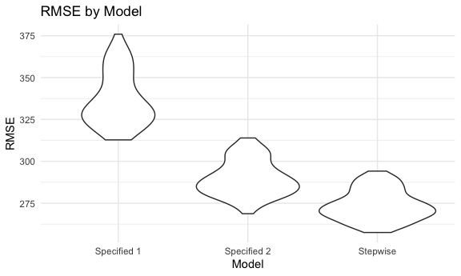

Homework 6
================
Fiona Ehrich

## Problem 1

First, I will read in the data and create a `city_state` variable and a
variable indicating whether the homicide is solved.

``` r
homicide_df = 
  read_csv("data/homicide-data.csv", na = c("", "NA", "Unknown")) %>% 
  mutate(
    city_state = str_c(city, state, sep = ", "),
    victim_age = as.numeric(victim_age),
    resolution = case_when(
      disposition == "Closed without arrest" ~ 0,
      disposition == "Open/No arrest"        ~ 0,
      disposition == "Closed by arrest"      ~ 1)
  ) %>% 
  filter(
    victim_race %in% c("White", "Black"),
    city_state != "Tulsa, AL") %>% 
  select(city_state, resolution, victim_age, victim_race, victim_sex)
```

I will start by fitting a logistic regression for Baltimore, MD and
displaying the estimate and confidence interval of the adjusted odds
ratio for solving homicides comparing non-white victims to white victims
keeping all other variables fixed.

``` r
baltimore_df =
  homicide_df %>% 
  filter(city_state == "Baltimore, MD")

glm(resolution ~ victim_age + victim_race + victim_sex, 
    data = baltimore_df,
    family = binomial()) %>% 
  broom::tidy() %>% 
  mutate(
    OR = exp(estimate),
    CI_lower = exp(estimate - 1.96 * std.error),
    CI_upper = exp(estimate + 1.96 * std.error)
  ) %>% 
  select(term, OR, starts_with("CI")) %>% 
  knitr::kable(digits = 3)
```

| term              |    OR | CI\_lower | CI\_upper |
| :---------------- | ----: | --------: | --------: |
| (Intercept)       | 1.363 |     0.975 |     1.907 |
| victim\_age       | 0.993 |     0.987 |     1.000 |
| victim\_raceWhite | 2.320 |     1.648 |     3.268 |
| victim\_sexMale   | 0.426 |     0.325 |     0.558 |

Now, I will run `glm` for each of the cities in the dataset and create a
data frame with estimated odds ratios and confidence intervals for each
city.

``` r
models_results_df = 
  homicide_df %>% 
  nest(data = -city_state) %>% 
  mutate(
    models = 
      map(.x = data, ~glm(resolution ~ victim_age + victim_race + victim_sex,
                          data = .x,
                          family = binomial())),
    results = map(models, broom::tidy)
  ) %>% 
  select(city_state, results) %>% 
  unnest(results) %>% 
  mutate(
    OR = exp(estimate),
    CI_lower = exp(estimate - 1.96 * std.error),
    CI_upper = exp(estimate + 1.96 * std.error)
  ) %>% 
  select(city_state, term, OR, starts_with("CI")) 
```

Finally, I will create a plot that shows the estimated odds ratios and
confidence intervals for each city.

``` r
models_results_df %>% 
  filter(term == "victim_sexMale") %>% 
  mutate(city_state = fct_reorder(city_state, OR)) %>% 
  ggplot(aes(x = city_state, y = OR)) + 
  geom_point() + 
  geom_errorbar(aes(ymin = CI_lower, ymax = CI_upper)) + 
  theme(axis.text.x = element_text(angle = 90, hjust = 1))
```


I notice that New York, NY has the lowest odds ratio, and Albuquerque,
NM has the highest odds ratio. Albuquerque, NM also appears to have the
widest confidence interval. There is a good amount over overlap among
the confidence intervals of the various cities.

## Problem 2

First, I will load and clean the data for regression analysis.

``` r
baby_df =
  read_csv("./data/birthweight.csv") %>% 
  mutate(
    babysex = as.factor(babysex),
    babysex = recode(babysex, "1" = "Male", "2" = "Female"),
    frace = as.factor(frace),
    frace = recode(frace, "1" = "White", "2" = "Black", "3" = "Asian", "4" = "Puerto Rican", "8" = "Other", "9" = "Unknown"),
    malform = as.factor(malform),
    malform = recode(malform, "0" = "Absent", "1" = "Present"),
    mrace = as.factor(mrace),
    mrace = recode(mrace, "1" = "White", "2" = "Black", "3" = "Asian", "4" = "Puerto Rican", "8" = "Other")
  )

# Checking to see if missing data
sum(is.na(baby_df))
```

    ## [1] 0

It doesn’t look like there are any missing data.

First, I am going to fit the two models that are specified in the
instructions.

``` r
baby_specified1_lm = lm(bwt ~ blength + gaweeks, data = baby_df)

baby_specified2_lm = lm(bwt ~ bhead * blength * babysex, data = baby_df)
```

I am now going to use stepwise regression to generate a third regression
model for birthweight (even though stepwise regression in not a
preferred method in this class, I feel most conceptually familiar with
this process\! I was looking into the LASSO method, but didn’t feel sure
that I was implementing it correctly).

``` r
baby_full_lm = lm(bwt ~ ., data = baby_df)

baby_step_lm = MASS::stepAIC(baby_full_lm, direction = "both", trace = FALSE) # This function chooses the best model by AIC; I selected both forward and backward selection

summary(baby_step_lm)
```

    ## 
    ## Call:
    ## lm(formula = bwt ~ babysex + bhead + blength + delwt + fincome + 
    ##     gaweeks + mheight + mrace + parity + ppwt + smoken, data = baby_df)
    ## 
    ## Residuals:
    ##      Min       1Q   Median       3Q      Max 
    ## -1097.18  -185.52    -3.39   174.14  2353.44 
    ## 
    ## Coefficients:
    ##                     Estimate Std. Error t value Pr(>|t|)    
    ## (Intercept)       -6098.8219   137.5463 -44.340  < 2e-16 ***
    ## babysexFemale        28.5580     8.4549   3.378 0.000737 ***
    ## bhead               130.7770     3.4466  37.944  < 2e-16 ***
    ## blength              74.9471     2.0190  37.120  < 2e-16 ***
    ## delwt                 4.1067     0.3921  10.475  < 2e-16 ***
    ## fincome               0.3180     0.1747   1.820 0.068844 .  
    ## gaweeks              11.5925     1.4621   7.929 2.79e-15 ***
    ## mheight               6.5940     1.7849   3.694 0.000223 ***
    ## mraceBlack         -138.7925     9.9071 -14.009  < 2e-16 ***
    ## mraceAsian          -74.8868    42.3146  -1.770 0.076837 .  
    ## mracePuerto Rican  -100.6781    19.3247  -5.210 1.98e-07 ***
    ## parity               96.3047    40.3362   2.388 0.017004 *  
    ## ppwt                 -2.6756     0.4274  -6.261 4.20e-10 ***
    ## smoken               -4.8434     0.5856  -8.271  < 2e-16 ***
    ## ---
    ## Signif. codes:  0 '***' 0.001 '**' 0.01 '*' 0.05 '.' 0.1 ' ' 1
    ## 
    ## Residual standard error: 272.3 on 4328 degrees of freedom
    ## Multiple R-squared:  0.7181, Adjusted R-squared:  0.7173 
    ## F-statistic: 848.1 on 13 and 4328 DF,  p-value: < 2.2e-16

Below is a plot of model residuals against fitted values for the new
model.

``` r
baby_df %>% 
  modelr::add_predictions(., baby_step_lm) %>% 
  modelr::add_residuals(., baby_step_lm) %>% 
  ggplot(aes(x = pred, y = resid)) +
  geom_point(alpha = .3) +
  labs(
    x = "Fitted Values",
    y = "Residuals",
    title = "Residuals vs Fitted Values"
  )
```


